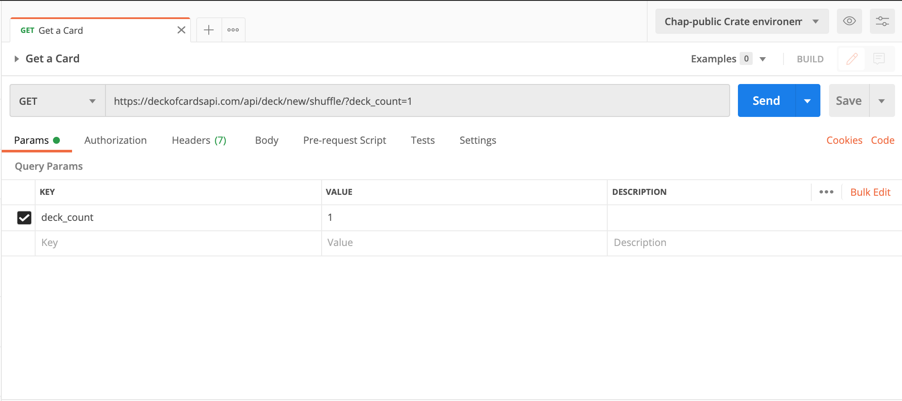
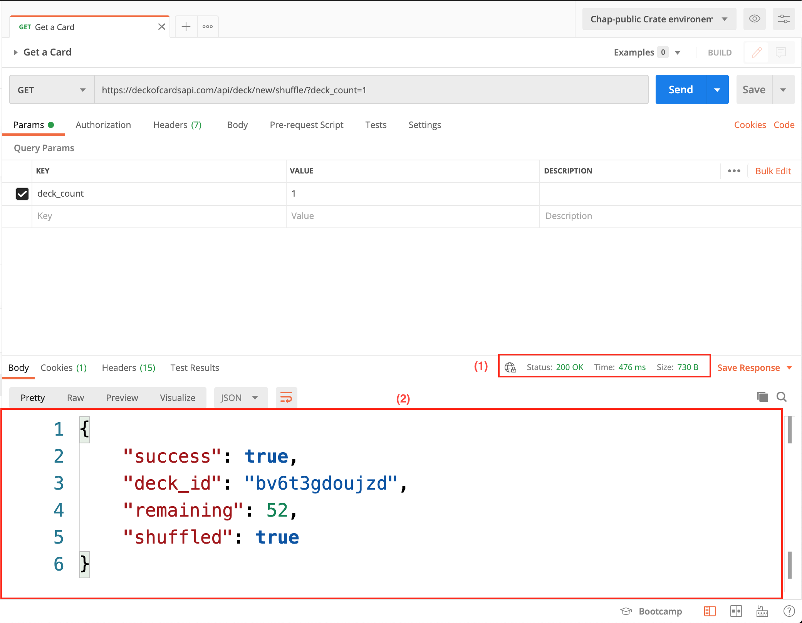

# Consuming REST APIs with Postman

When exploring a REST API it's great to have a visual tool to play around with the actual API without having to write code. One such tool is [Postman](https://www.postman.com/). 

Starting up Postman we first need to create a *collection*. Collections combine requests together and you can see all your collections on the left part (the red highlighted area in the screenshot below). Collections can either be created by you or by others and then shared with you! For example the Meraki team publishes a collection of all the requests that are possible with the Meraki API. 

By clicking "New" and then "Collection" we can get a new collection. 

Next, create a new *request* in our newly created collection by going to "New" and then "Request". You will be prompted for a name, a description and to which collection you would like to add this request. 

With that done we have the request editor opened and can start making API requests using Postman. 

(1) is the HTTP method we want to use. Clicking on the method will reveal a drop down with all available options. We will leave it at `GET` for the time being. 

(2) Is the URL field. Here we are going to put the URL of the API we want to request.

(3) Shows the different additional information we can add to our request. You can see *Query Parameters*, *Authorization*, *Headers* and *Body* among others.

As an example we will be using the *Deck of Cards API*. This API is a educational API that allows you to do all sorts of things like drawing a card or shuffling a deck of cards with a few REST API calls. You can find the webpage [here](https://deckofcardsapi.com/).

So lets make our first request in Postman and get ourself a new deck of cards. 

The URL for this is `https://deckofcardsapi.com/api/deck/new/shuffle/`. Based on what we learned during the last chapter you can see that we are requesting the resource `deck` so we are going to put this into the Url field (area 2 in above screenshot). 

Now, we also need to tell the deck of cards api how many decks we would want. This information is passed as a *query parameter*. 

REST distinguishes two (widely used) types of parameters: 

* *Path Segment Parameters* These are the parameters that are directly within the URL. In our previous example (`GET /api/v1/people/me`) the `me` parameter telling the API server to retrieve all information that are related to me myself is a *path argument* because it is part of the path itself.
* *Query Parameters* that are passed at the end of the resource identifier. These query parameter are often used to pass on additional information like filtering. The query parameter part always starts with a `?` and we then append the parameters after that. So a `GET` request where we are filtering for a certain date (using the query parameter `date`) and a certain name (using the query parameter `name`) would look like this: `GET /api/v1/example?date=2020-08-10&name=Marcel`

For the deck of cards API the *query parameter* to specify the number of decks is `deck_count`. In Postman we can specify these parameters directly in the interface under *Params*. 

Our final request thus looks like this: 

Clicking "Send" will send this request and return a response. 

(1) Shows you the status line of our response. As you can see the API returned a `200 OK` meaning that the request was responded to successfully. 

(2) Shows the request body. Our API has returned a json string containing, among other things a `deck_id` and the number of cards that are remaining in our deck. 

Take note of that `deck_id` as we will be using it in the next chapter. 

Postman is a great tool for exploring an API but when automating workflows there is no way around using python (or another programming language) so lets go ahead and see how we can draw a card from the deck we just created using python!

   
   [Prev](Readme.md) - [Next](requests.md)

